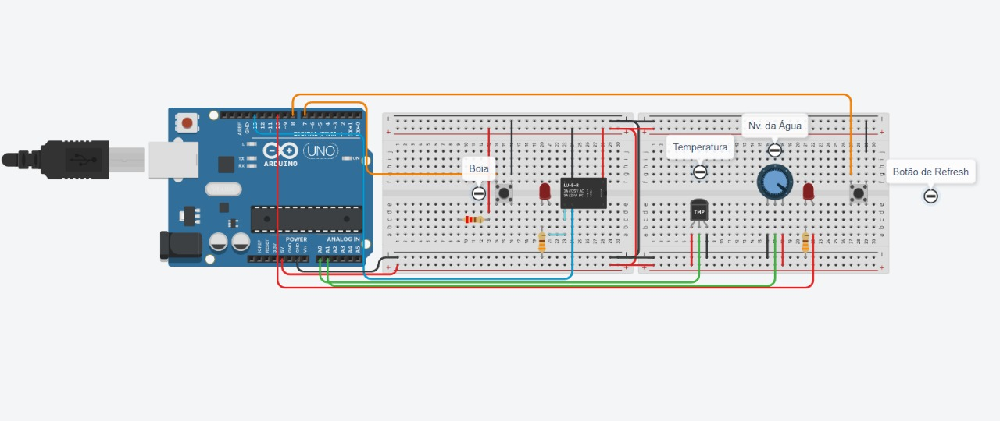
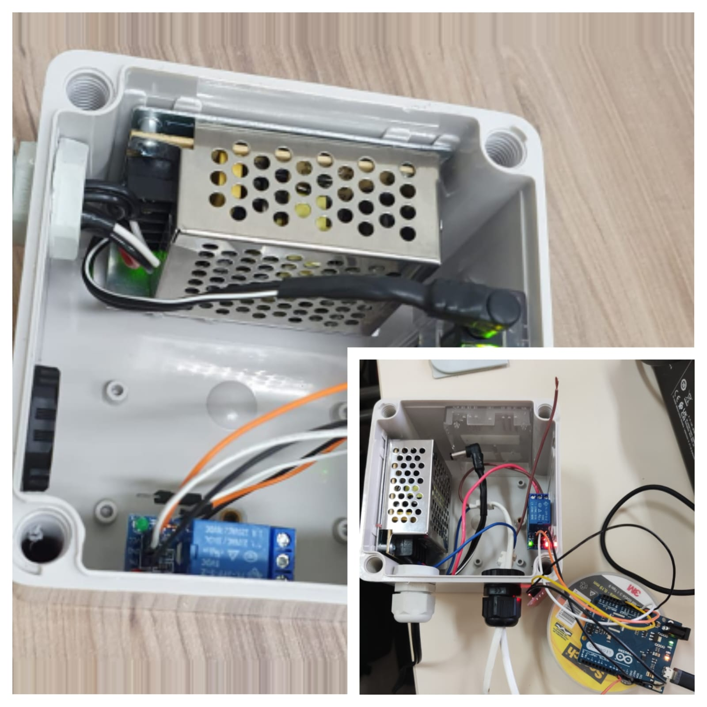
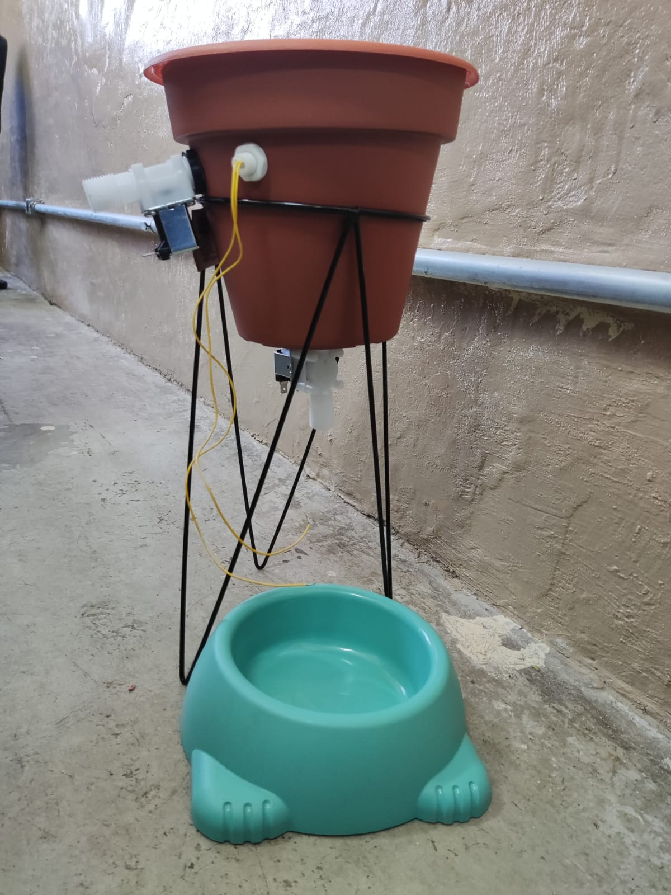

# CENTRO	PAULA SOUZA
# FATEC DEPUTADO ARY FOSSEN

## Sistemas embarcados - 1º semestre - 2022
___________________________________________________________

### Bebedouro para pets automatizado

#### Abner   
#### Elionay
#### Erick
#### Larissa
#### Luiz
---
**SUMÁRIO_**

1.	Descrição do projeto
2.	Lista de materiais
3.	Montagem
4.	Código-fonte
5.	Resultados      
---

1.1

  A ideia do projeto se originou devido a dificuldade de suprir uma das necessidades básicas dos nossos pets quando estivermos ausentes, com um dispositivo de abastecimento de água automático conseguimos resolver essa questão que se da devido ao consumo imprevisível durante o dia. Sendo um dispositivo compacto e de simples manuseio, pode ser alocada em diversos lugares da residência e habitats externos, tornando-o útil para diversas espécies de animais domésticos ou de pequeno porte.  Por meio dessa tecnologia, visamos trazer praticidade e bem-estar tanto na vida dos animais quanto aos seus donos.
     
   ---

 2.1
 
  - Placa arduinbo 'Leonardo ATMEGA32U4';
  - Módulo rele 1 canal;
  - Sensor de nível de água analógico;
  - Pastilha termoelétrica 'PELTIER';
  - 2 Solenoides 12V;
  - Fonte 12V;
  - Galão de água -10 litros;
  - Suporte para o galão;
  - Comedouro -plástico.
  - Mangueira de silicone;
  - Jumpers;
  - Caixa organizadora de PVC;

---

3.1
### Montagem no simulador Tinkercad para funcionamento dos sensores:
                      
 
 
### Organização dos componentes dentro da caixa de PVC:
                       

### Estrutura:
                         

---

4.1 
### Código de acionamento 

```

int boia = 7;
int sensorNivel = A0;
int rele1 = 13;
int rele2 = 10;

void setup() {
  Serial.begin(9600);
  pinMode(boia,INPUT_PULLUP);
  pinMode(sensorNivel,INPUT);
  pinMode(rele1,OUTPUT);
  pinMode(rele2, OUTPUT);
}

void loop() {
  // Leitura dos sensores
  int valorBoia = digitalRead(boia);
  
  // Simulação do nível da água (400ml)
  int valorSensor = analogRead(sensorNivel);
  
  // Se a boia acionar, rele1 = HIGH
  if(valorBoia == HIGH){ 
    digitalWrite(rele1,LOW);
    
  } 
  else{
    delay(10000);
    digitalWrite(rele1,HIGH);
  }

  if(valorSensor > 277 || valorSensor >= 550){ 
    digitalWrite(rele2,LOW);
    
  } 
  else{
    delay(10000);
    digitalWrite(rele2,HIGH);
  } ''''

 // 0 a 553
 
  delay(100);
}

````

---
5.1 
### Conclusão:

  
 
 O arduino controla o funcionamento do rele como esperado, assim a válvula libera e bloqueia a passagem da água com o auxílio dos sensores para que essa ação seja realizada no momento certo, abastecendo o recipiente do cachorro. Como o dispositivo é automatizado, deixamos seu depósito de água ligado diretamente á uma torneira para que não se faça necessária a ação de abastecimento.

 O projeto atendeu a nossa expectativas, sendo um dispositivo de fato funcional e prático, podendo ser replicado por pessoas com rotinas agitadas e alocado em diversos locais da residência.
